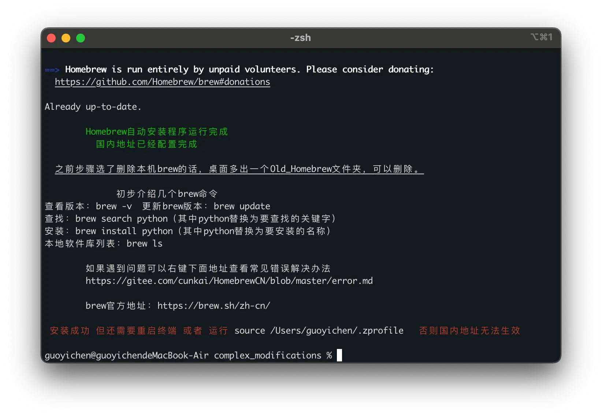

B站讲解视频

https://www.bilibili.com/video/BV1vYY6eEEXS/?spm_id_from=333.337.search-card.all.click&vd_source=2a60ec439c73bd648e612ff7e86f7486

官网链接

https://brew.sh/

安装homebrew

```bash
/bin/bash -c "$(curl -fsSL https://raw.githubusercontent.com/Homebrew/install/HEAD/install.sh)"
```


# 中国大陆用户安装 Homebrew参考以下教程
https://blog.csdn.net/weixin_38716347/article/details/123838344?ops_request_misc=%257B%2522request%255Fid%2522%253A%25222f95da5dc6d439a424a87908b0dfcb0b%2522%252C%2522scm%2522%253A%252220140713.130102334..%2522%257D&request_id=2f95da5dc6d439a424a87908b0dfcb0b&biz_id=0&utm_medium=distribute.pc_search_result.none-task-blog-2~all~top_positive~default-1-123838344-null-null.142%5Ev102%5Epc_search_result_base4&utm_term=mac%E5%AE%89%E8%A3%85homebrew&spm=1018.2226.3001.4187

```bash
/bin/zsh -c "$(curl -fsSL https://gitee.com/cunkai/HomebrewCN/raw/master/Homebrew.sh)"
```




当然可以！以下是为初学者编写的 **Homebrew 教程**，内容覆盖从安装到日常使用，非常适合 Mac 用户。

---

# 🍺 Homebrew Tutorial for Beginners

> 学习如何在 macOS 上使用 Homebrew 这款强大又简洁的包管理器。

---

## 📦 什么是 Homebrew？

Homebrew 是 macOS 上最受欢迎的包管理工具，它可以帮助你轻松安装、更新和卸载各种开发工具、命令行程序、GUI 应用等。

口号是：

> *“The missing package manager for macOS”*

---

## 🧩 目录

1. [安装 Homebrew](#1-安装-homebrew)
2. [验证安装是否成功](#2-验证安装是否成功)
3. [常用命令介绍](#3-常用命令介绍)
4. [使用案例](#4-使用案例)
5. [扩展：安装 GUI 应用（Cask）](#5-扩展安装-gui-应用cask)
6. [卸载 Homebrew（可选）](#6-卸载-homebrew可选)
7. [常见问题](#7-常见问题)

---

## 1. 安装 Homebrew

### 🛠 打开终端（Terminal）并粘贴以下命令：

```bash
/bin/bash -c "$(curl -fsSL https://raw.githubusercontent.com/Homebrew/install/HEAD/install.sh)"
```

这个命令会自动下载并配置 Homebrew，包括路径设置。

---

## 2. 验证安装是否成功

安装完成后，在终端中输入：

```bash
brew --version
```

你应该会看到类似以下内容：

```
Homebrew 4.x.x
Homebrew/homebrew-core (git revision ...)
```

如果成功，就可以开始使用啦！

---

## 3. 常用命令介绍

| 功能             | 命令示例                   |
| -------------- | ---------------------- |
| 搜索包            | `brew search <软件名>`    |
| 安装包            | `brew install <软件名>`   |
| 卸载包            | `brew uninstall <软件名>` |
| 更新 Homebrew 本身 | `brew update`          |
| 升级所有已安装包       | `brew upgrade`         |
| 查看已安装的包        | `brew list`            |
| 清理无用旧版本        | `brew cleanup`         |

---

## 4. 使用案例

### 🎯 安装 wget：

```bash
brew install wget
```

安装后你可以使用：

```bash
wget https://example.com
```

### 🧰 安装 Python（如 3.11）：

```bash
brew install python@3.11
```

### 🔍 查看 Python 版本：

```bash
python3 --version
```

---

## 5. 扩展：安装 GUI 应用（Cask）

Homebrew 也可以安装图形界面应用：

```bash
brew install --cask google-chrome
brew install --cask visual-studio-code
```

你甚至可以这样更新它们：

```bash
brew upgrade --cask
```

---

## 6. 卸载 Homebrew（可选）

如果你想完全卸载 Homebrew，可以使用以下命令：

```bash
/bin/bash -c "$(curl -fsSL https://raw.githubusercontent.com/Homebrew/install/HEAD/uninstall.sh)"
```

---

## 7. 常见问题

### ❓ 安装时提示“Permission denied”？

* 确保你有管理员权限
* 使用 `sudo` 不适用于 Homebrew 安装脚本，请不要加

### ❓ Intel 和 Apple Silicon 有区别吗？

* Homebrew 自动识别芯片架构（Intel 或 M1/M2），并安装在合适位置（如 `/opt/homebrew`）

### ❓ 怎么安装 GUI 的 Homebrew App Store？

你可以试试：

```bash
brew install --cask cakebrew
```

它提供一个图形界面来管理 Homebrew。

---

## ✅ 总结

| 操作     | 命令                        |
| ------ | ------------------------- |
| 安装包    | `brew install xxx`        |
| 安装 GUI | `brew install --cask xxx` |
| 卸载包    | `brew uninstall xxx`      |
| 升级     | `brew upgrade`            |

---

是否需要我将这篇教程保存为 `Homebrew Tutorial for Beginners.md` 文件并加入你的项目中？如果你还希望我加入更多示例（如 Python 环境管理等），也可以继续扩展。

